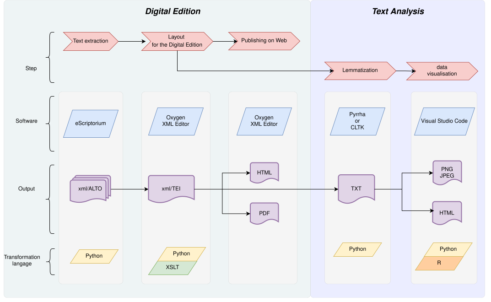

# 📘 Example Exercises

This section presents examples based on my pipeline, adapted for use with other types of content.

---

### 🔗 Pipeline Source

All scripts used in this pipeline are adapted from those available at:  
👉 [16thExegesisDH/PipeLineThm](https://github.com/16thExegesisDH/PipeLineThm)

---

### 🔄 Workflow Overview

The pipeline follows the main structure illustrated in the diagram below:

